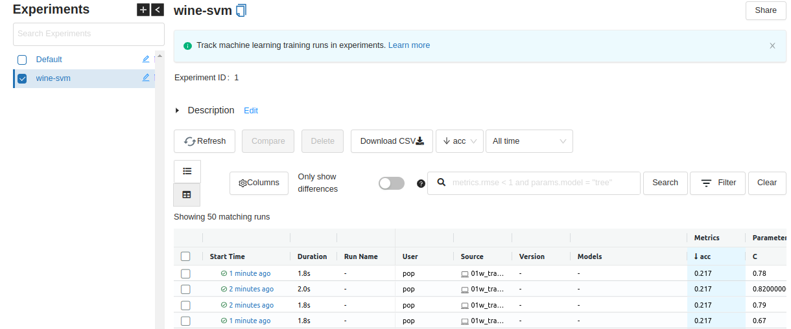

# Project Overview

In this project, a model will be trained, monitored, and deployed while following a basic MLOps framework.

Since the goal of this project is not to achieve high accuracy, issues regarding class balancing are NOT part of the project (the dataset used is highly imbalanced). Only a basic feature selection has been attempted. The aim is to train a model as part of a pipeline. Specifically, in this pipeline,
- best practices of software development will be followed
- the experiment/model training will be tracked
- model will be deployed to a streaming/batch service
- performance of the model will be monitored

# Instructions
Please change into the directory specified after each heading in order to execute commands.

# Data Description

The dataset is part of the [UCI ML Repository](https://archive.ics.uci.edu/ml/datasets/wine+quality). Only the white wines from the dataset are being used. It has been split into a train/test set (80/20).

For a complete overview of the dataset, see the [info file](./winequality.names) taken from the repo.

To identify the salient features, basic EDA was performed. Using correlation, the top three features were identified, and were used as input features. All three are numbers (i.e. numerical features). The predicted variable (quality) is a categorical variable. Hence, a classification model is used for the project.


# §1 - Experiment tracking and model registry
> Tool used: MLFlow, S3
> Folder: 01_model

[We need to create an AWS bucket to store the artifacts/models. This can be done via `aws s3 mb s3://mlopszc-project-artifacts`].

Two experiments were performed.

One is for hyperparameter tuning. 50 trials were performed. However, in order to save space, none of these models were saved/registered. Only the accuracy metric along with the hyperparameters were logged. This experiment is the `wine-svm` experiment that can be seen in the screenshot. To launch the MLflow UI, execute:

```bash
mlflow server --backend-store-uri sqlite:///mlflow.db --default-artifact-root s3://mlopszc-project-artifacts
```




In the second experiment, top 5 models from the 50 trials were retrieved and logged to the artifacts location (S3 bucket). This experiment is the `wine-svm-best-models` experiment that can be seen in the screenshot.


These models can be seen in the S3 bucket as well.


Of these, the best model was the one with the run_id starting with `7ffc2`.


Here, we can see the URL of the saved model. This model will be retrieved and used for subsequent parts of the project.

The best model was registered. This, in the real world, can later be promoted to the staging or production stage.


# §2 - Workflow orchestration
> Tool used: Prefect, S3
> Folder: 01_model

The training code for both experiments were divided into smaller blocks and designated as `tasks`. The main flow was defined as a `SequentialTaskRunner`

For the first experiment, there were two tasks.


For the second experiment, there were four tasks.


# §3 - Local Model deployment

(This part was performed to test the code. The final deployment was done on Cloud - scroll below for that.)

Once the model was trained, we can wrap it inside a docker image.

## §3.1 - Local Deployment
> Tool used: Docker
> Folder: 02_deploy/01_local

First, we deploy it locally. We can use this to check if the model can be used properly to make a prediction.

The script is titled `predict.py`. It loads the model from a local path (the best model from S3 was downloaded), creates features, and makes a prediction. The script is wrapped in Flask. To test the app, we can run the `test.py` file, which sends a request.


The same model is then wrapped and then executed inside a docker container via

```bash
docker build -t proj:p3_dl .
docker run -it --rm -p 9696:9696 proj:p3_dl
```

To test this image, we can run the same `test.py` file. And we will get the same result as above

## §3.2 - Local Deployment - Kinesis Trial
> Tool used: Docker, Lambda, Kinesis
> Folder: 02_deploy/02_streaming

Generate - rather simulate - (fake) kinesis stream request. We take the sample kinesis record from the class and replace the `Data` key with our test data converted to 64bit code via the following bash command

```bash
wine_features='{
    "wine_features": {
        "alcohol": 8.8,
        "volatile acidity": 0.27,
        "sulphates": 0.45
    },
    "customer_id": 123
}'

echo $wine_features | base64
```

We copy the output into the `test_lambda.py` and `test_docker.py` files.

To test the lambda function itself, we run the following

```bash
export TEST_RUN='True'
export RUN_ID='7fffc2ed5cbc451890a7ad1e23d20162'
python test_lambda.py
```

Now, since we will be deploying this to ECR, we need to wrap this in a docker container that builds upon a lambda image from AWS.

```bash
docker build -t proj:p3_dl_lambda .
docker run -it --rm -p 9696:9696 proj:p3_dl_lambda
```

To execute the container, we have to pass arguments each time. We can use a `docker-compose.yml` file to 'automate' the passing of arguments.

(Make sure your AWS credentials exist as environment variables since they will be passed to the docker container)

```bash
docker-compose up -d
python test_docker_kinesis.py
```


If you want to read the output from the prediction stream, create one first via

```bash
aws kinesis create-stream \
	--stream-name mlops-proj-predict \
	--shard-count 1 \
	--stream-mode-details StreamMode="PROVISIONED" \
	--region us-east-2
```

Then, set `TEST_RUN=False` in the `docker-compose.yml` file.

To read from the stream, use the following commands

```bash
SHARD_ITERATOR=$(aws kinesis \
    get-shard-iterator \
        --shard-id shardId-000000000000 \
        --shard-iterator-type TRIM_HORIZON \
        --stream-name mlops-proj-predict \
        --query 'ShardIterator' \
        --region us-east-2 \
)

RESULT=$(aws kinesis get-records --shard-iterator $SHARD_ITERATOR --region us-east-2)

echo ${RESULT} | jq -r '.Records[-1].Data' | base64 --decode | jq
```


# §4 - Cloud Deployment using Infrastructure Provisioning
> Tool used: Terraform, ECR, Lambda, Kinesis
> Folder: 03_monitor

The steps for model deployment on AWS can be automated using terraform.

Our terraform script must
- push image to ECR
- create input and output kinesis streams
- create lambda function along with its role and policies, and a trigger mechanism

This can be done via the commands

```bash
terraform init
terraform plan
terraform apply
```


To test the deployment, use the sequence of commands in §3. and §3.2 to send/receive request respectively with the stream names as `mlop-wine-input_mlops-proj` and `mlop-wine-prediction_mlops-proj` respectively. e.g.

```bash
aws kinesis put-record \
    --stream-name mlop-wine-input_mlops-proj \
    --partition-key 1 \
    --region us-east-2 \
    --cli-binary-format raw-in-base64-out \
    --data '{
        "wine_features": {
            "alcohol": 8.8,
            "volatile acidity": 0.27,
            "sulphates": 0.45
        },
        "customer_id": 159
    }'

SHARD_ITERATOR=$(aws kinesis \
    get-shard-iterator \
        --shard-id shardId-000000000000 \
        --shard-iterator-type TRIM_HORIZON \
        --stream-name mlop-wine-prediction_mlops-proj \
        --query 'ShardIterator' \
        --region us-east-2 \
)

RESULT=$(aws kinesis get-records --shard-iterator $SHARD_ITERATOR --region us-east-2)
echo ${RESULT} | jq -r '.Records[-1].Data' | base64 --decode | jq
```


Once completed, destroy all created resources via
```bash
terraform destroy
```

# §5.1 - Model monitoring
> Tool used: Evidently, Prometheus, Grafana
> Folder: 04_monitor

Evidently is used to collect data and check for data drift.Unfortunately, all three input variables had drift in them. The data is then sent to Prometheus and Grafana for visualization.


# §6.1 - Code Review

> Tool used: pre-commit, black, isort
> Folder: (root)

The pre-commit hooks were defined in the `.pre-commit-sample.yaml` file.

```
pre-commit sample-config > .pre-commit-config.yaml
pre-commit install
```

Errors were fixed on first commit.
